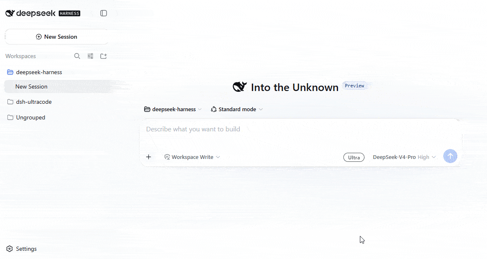

<p align="right">
  <a href="./README.md">English</a> · <strong>简体中文</strong>
</p>

# DeepSeek Harness Ultracode

<p align="center">
  <a href="https://www.npmjs.com/package/dsh-ultracode"></a> <a href="./LICENSE"></a> 
</p>

## 一个开关，拉满深度。

`dsh-ultracode` 给 DeepSeek Harness 加一个 **ultra 档位**：一个按会话生效的开关——把每个模型请求钉在当前模型声明的最深推理档上，同时激活常驻的编排策略：实质性任务默认 workflow 扇出、汇报前对抗验证、上下文卫生。

对标 Claude Code 的 `ultracode` 档位：这个档位的实质是常驻编排策略，而不是更深的推理参数。适用于任何适配器档位落在共享词表内的 provider——DeepSeek（`max`）、GLM / Kimi 路由（`high` 或 `max`，取模型声明的最高档）、以及完全自定义的 OpenAI 兼容路由。

<p align="center">
  
</p>

<p align="center">
  <em>在输入框边切换：模型选择器旁会出现 <strong>ULTRA</strong> 芯片，档位生效期间输入卡亮起动态彩虹描边。</em>
</p>

## 它改变了什么

| 能力 | 变化 |
| --- | --- |
| **按会话的 effort 档位** | 一个开关把每个模型请求钉在当前模型声明的最深档（`auto`），或钉在配置的字面值上。 |
| **编排策略** | 激活期间一段部署侧拥有的提示词段随系统提示下发：workflow 常驻授权、对抗验证、provider 并发受限时改窄波次重试。 |
| **输入框芯片 + 彩虹描边** | 输入栏出现 ULTRA 芯片；档位生效期间输入卡发光（系统开启“减少动态效果”时为静态渐变）。 |
| **选择器一致性** | 切换时通过公开的 models API 重新提交会话档位选择，原生选择器显示的永远是真实生效的档位。 |
| **委托感知** | spawn 子代理沿委托链继承生效状态；fork 子代理经种子前缀继承并在那里冻结。 |

## 安装

> [!NOTE]
> 需要已安装 [DeepSeek Harness](https://github.com/deepseek-ai/deepseek-harness)（`@deepseek-ai/dsh-* >= 0.1.0-rc.6`）。

### npm

```sh
dsh plugin --profile <name> add dsh-ultracode
```

### 从源码构建

```sh
git clone https://github.com/BackMountainBird/dsh-ultracode.git
cd dsh-ultracode
pnpm install
pnpm build
dsh plugin --profile <name> add .
```

改完源码再跑一次 `pnpm build`。本地安装保持链接到该 checkout。

校验组合并重启 DSH：

```sh
dsh --profile <name> --dump-config
dsh --profile <name> web
```

然后打开档位——点输入框芯片，或直接：

> /ultra
>
> 用 ultra 模式把这个仓库的每一个集成点对照锁定的依赖逐一核实，并行验证。

用 `/ultra off`（或再点一次芯片）退出。

## 工作原理

1. **开关就是一条命令。** `/ultra`（和 `/ultra off`）经 harness 命令运行时执行，它在调用处理器*之前*追加 `command/run` 会话事件。这个事件就是持久化状态——插件不定义自己的会话事件，resume 和重放免费恢复状态，最后一条命令获胜。
2. **策略随系统提示下发。** 激活期间，`ultra:policy` 段渲染进每个请求。文案是部署侧 config；默认值即编排策略（workflow 常驻授权、对抗验证、上下文卫生、provider 并发打满导致并行子代理超时时改窄波次）。
3. **档位按请求钉死。** 一个 `agent/request` 瀑布监听器——prepend 注册，永远位于会剥掉它的 model-selection 监听器之外——替换每个请求的推理档。`auto`（默认）按共享的 `off…max` 词表解析当前模型声明的最深档；字面值精确钉定，适配器不声明则大声失败。
4. **委托会继承。** spawn 子代理沿委托链上溯（每个子会话的 `parentSession`，经活会话存储解析）获得钉档和策略——档位按*子代理自己的*模型解析。fork 子代理只经种子完成前缀继承；父会话之后的切换不会影响已经派生的分支。
5. **模型会被告知。** 每次真实切换注入一条插件来源的 notice 用户消息，模型无需 diff 提示词段就能感知变化。
6. **选择器跟随。** 芯片切换的同时经公开的 models API 重新提交会话的模型选择（开启时最深档、退出时 provider 默认），原生档位选择器显示的即真实生效的档位。请求侧钉档仍是最终保证。
7. **Web 半边是一个 client bundle。** ULTRA 芯片占用输入栏的 `conversation.input.right` 座位；状态走宿主计算的 `ultra` projection（客户端零 ultra 状态）；激活期间芯片标记输入卡，注入的样式表渲染彩虹描边。bundle 以闭包工厂（`window.__ModuleLoader__.load`）发布，平台依赖经 loader 模块表解析。

## 配置

Profile 的 `dsh-ultracode` 行：

```yaml
- id: dsh-ultracode
  config:
    effort: auto
```

| 字段 | 默认值 | 含义 |
| --- | --- | --- |
| `section` | 内置策略文案 | 激活期间渲染为 `ultra:policy` 提示词段 |
| `effort` | `auto` | `auto` 把每个请求钉在当前模型声明的最深档；字面值必须是服务适配器声明的档位之一（否则大声失败） |
| `promptSectionOrder` | `120` | 提示词段顺序 |

## 边界

- 状态就是 harness 自有的 `command/run` 事件：无自定义会话事件，且工具目录跨模式不变（请求缓存稳定）。
- 继承只增不减：子代理会话没有用户命令面，子级无法退出。
- 请求侧钉档是事实；选择器同步是显示一致性——ultra 期间手动改选的档位在下一次切换时重新对齐，而请求始终按钉档发出。
- 扇出容量属于 provider：默认策略要求模型把超时的并行工作改窄波次重试，而不是放弃。
- ultra 不触碰 plan 模式：两者是独立的日志化状态，可自由叠加（`/plan` + `/ultra` = plan 只读约束下的最高档规划）。

## 开发

```sh
pnpm install
pnpm run typecheck
pnpm run build
pnpm run verify
```

Host 半边在 `src/`（命令、钉档、提示词段、会话投影、委托链上溯）；浏览器半边在 `src/client/`（输入栏芯片、彩虹样式、选择器同步）。Peer 下限是 `@deepseek-ai/dsh-*@^0.1.0-rc.6`；devDependencies 钉在下限版本上开发，防止漂移到更高版本才有的 API。

## 许可证

[MIT](./LICENSE)
